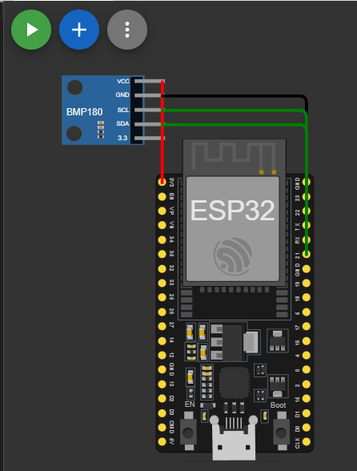

# IoT-Station
SYT ITP Projekt – ESP32 IoT Station mit BMP280, ESP-NOW und Webserver

##  Fach
Systemtechnik (SYT)

## Gruppe
- Burak Topcu
- Parsa Risherihzade

---

# Projektziel

Ziel dieses Projekts war es, zwei ESP32 Mikrocontroller zu einer IoT-Station zu entwickeln.

Ein ESP32 (Sender) misst Temperatur und Luftdruck mit einem **BMP280 Sensor** und überträgt die Daten mittels **ESP-NOW** an einen zweiten ESP32 (Receiver).

Der Receiver:
- visualisiert die Daten in einem Webinterface
- speichert historische Durchschnittswerte
- stellt eine API bereit
- steuert einen Buzzer als Aktor

---

# Systemarchitektur

BMP280 → ESP32 A (Sender) → ESP-NOW → ESP32 B (Receiver) → Webserver + Graph + API + Buzzer

---

# Verwendete Komponenten

| Komponente | Anzahl | Beschreibung |
|------------|--------|--------------|
| ESP32 Dev Board | 2 | Sender & Receiver |
| BMP280 | 1 | Temperatur & Drucksensor |
| Allnet Buzzer | 1 | Akustischer Aktor |
| Breadboard | 1 | Steckbrett |
| Jumper Kabel | mehrere | Verbindungen |
| USB Kabel | 2 | Stromversorgung |

---

# Sensor – BMP280

Der BMP280 misst:

- Temperatur (°C)
- Luftdruck (Pa)

Messintervall:
- Alle 2 Sekunden

# 🔌 Schaltplan

## Sender (ESP A + BMP280)

Der Sender besteht aus einem ESP32 und einem BMP280 Sensor.

Verdrahtung:

| BMP280 | ESP32 |
|--------|--------|
| VCC | 3.3V |
| GND | GND |
| SDA | GPIO 21 |
| SCL | GPIO 22 |

Schaltplan:



---

## Receiver (ESP B + Buzzer)

Der Receiver besteht aus einem ESP32 und einem Allnet Buzzer.

Verdrahtung:

| Buzzer | ESP32 |
|--------|--------|
| Signal | GPIO 27 |
| GND | GND |

Schaltplan:


# Übertragene Datenstruktur:

```cpp
typedef struct __attribute__((packed)) {
  uint32_t seq;
  float tempC;
  float pressurePa;
} SensorPacket;
